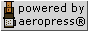
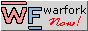
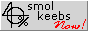
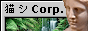

proud netizen! here are my interests

- 🎸 smol web
- 🐧 unixy stuff
- 🎹 music
- 🧀 cheese

Checkout my website at [plainoldcheese.neocities.org](https://plainoldcheese.neocities.org/), and I'm also on mastodon now <a rel="me" href="https://masto.ai/@plainoldcheese">plainoldcheese@masto.ai</a>.

<footer>
   

      
profile visits

      
    

    
    
    
    
    
    
    
    
    
    
    
    
    <!--  -->
    
    
    
    
    
	  
    
</footer>
